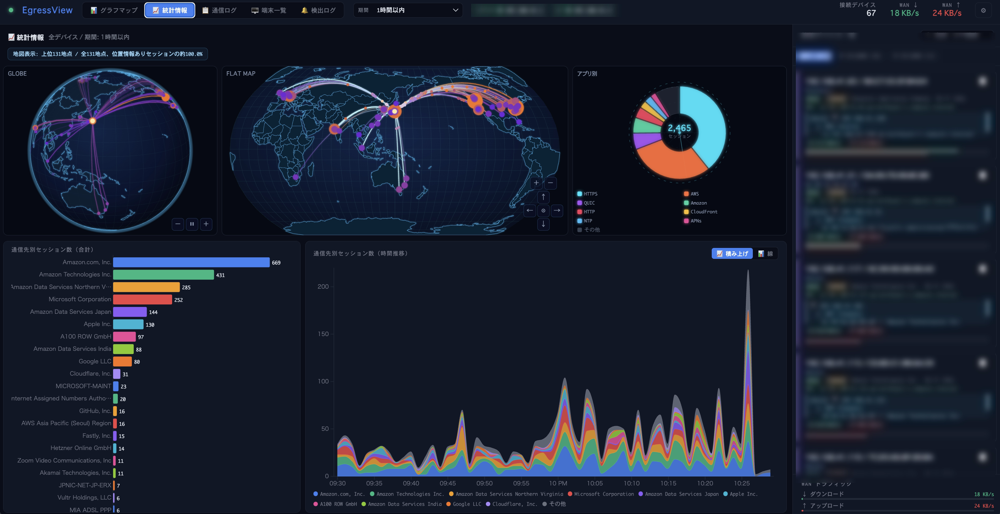
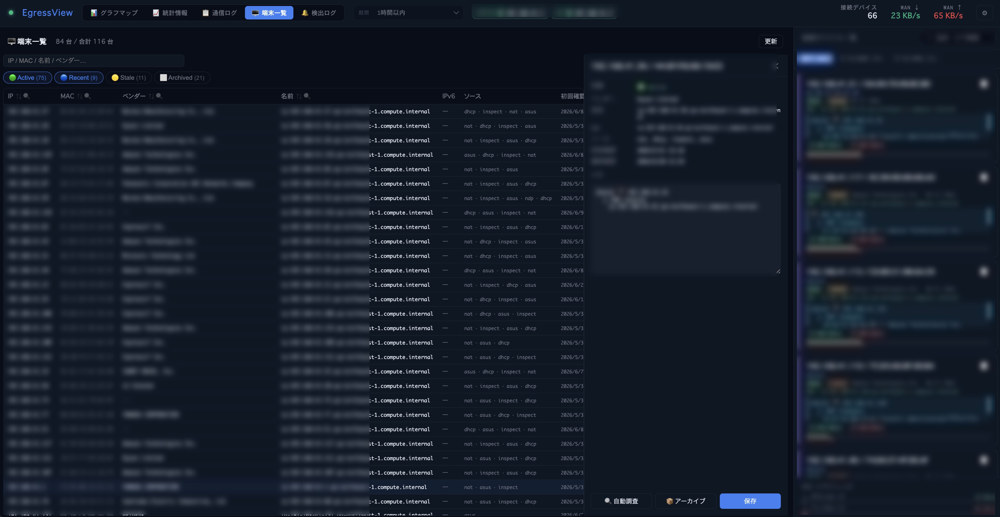

# EgressView

**家庭・SOHO向けネットワークセキュリティモニター — LAN内の全デバイスの通信先をリアルタイムに可視化**

スマートTVが見知らぬサーバーと通信していないか？IPカメラやIoT機器、NASが許可していない接続をしていないか？EgressViewは、LAN内の全デバイスが外部と行う通信を**パッシブに監視**し、グラフマップ/統計情報で全体像を把握し、通信ログ/端末一覧で詳細へドリルダウンできます。脅威フィードとの自動照合、Slack通知に対応。

追加ハードウェア不要。通信の中継・傍受も不要。既存のYamaha RTXとCisco IOSルーターのNATセッションテーブルを読み取るだけで動作します。AWS Kiro・Anthropic Claude・Anysphere Cursor 等の AI アシスタントは、内蔵 MCP サーバーを通じて EgressView に直接アクセスできます — 自然言語でネットワーク状況を問い合わせるだけ。


> 🇬🇧 [English README](README.md) | 🌐 [プロジェクトページ](https://yo1t.github.io/egressview/index.ja.html)

---

## プロジェクトの状態

EgressView は Yamaha RTX / Cisco IOS を使う家庭・SOHOネットワーク向けに、実運用を意識して開発しています。ASUS AP 連携と任意のデータソースは補助的な連携としてメンテナンスしています。

### v1.4.0の主な変更

v1.4.0では、モバイル監視ビュー、絞り込んだ通信履歴のCSV/JSON出力、明示操作による手動脅威調査、Linux conntrackプレビューを追加しました。複数ルーター向けDB schema v5移行も完了し、HTML文字列による画面描画とCSPのinline style例外を廃止しました。DBリストアと設定保存もfail-closed方式に強化しています。詳細は[変更履歴](CHANGELOG.md)を参照してください。

既存DBは起動時に自動移行されます。schema v5適用前にバックアップの作成・検証と観測データの整合性確認を行い、いずれかが失敗した場合はDBを変更せず起動を停止します。Linux conntrackはDocker統合試験済みのプレビューで、実機ルーターでの検証は未完了です。

## 家庭・SOHOのセキュリティ対策として

現代の家庭やSOHOネットワークには、スマートTV・IPカメラ・NAS・Wi-Fiスピーカー・プリンター・ネットワーク機器・PC・スマートフォンなど、20〜40台以上のデバイスが接続されています。IoT機器の多くはファームウェア更新が不定期で、どこに通信しているか把握されていません。一度侵害されると、C2サーバーへのデータ流出やボットネットへの加担が、ユーザーに気づかれないまま進みます。

EgressViewは、多くの家庭ユーザーが答えを持てていない問いに答えます：**自分のネットワーク上の各デバイスは、今どこと通信しているのか？**

- **パッシブ・ゼロインパクト監視** — ルーターのNATセッションテーブルをSSHで読み取るだけ。通信の中継・傍受なし、スループット低下なし
- **デバイス単位の可視性** — OUI・mDNS・SSDP・NetBIOSによるデバイス識別で、どの機器が何と通信しているかを把握
- **自動脅威検出** — Feodo Tracker・ThreatFox・URLhaus・Spamhaus DROPとリアルタイムに全接続を照合
- **外部サービスによる手動脅威調査** — 明示操作時だけAbuseIPDB・VirusTotal・AlienVault OTXへ問い合わせ（cache/rate limit対応、[ガイド](docs/manual-threat-investigation.ja.md)）
- **Linux conntrackプレビュー** — Linux系ルーターからSSH収集。Docker統合試験済み、実機確認は未完了（[設定](docs/setup-conntrack.ja.md)）
- **モバイル監視ビュー** — VPN・プライベートネットワーク内のスマートフォンから、ルーター状態、グラフ、統計、通信ログ、端末一覧、検出ログを確認
- **AI洞察スタートページ** — 起動直後に収集状態・接続・端末・宛先・脅威と前期間比較を表示。Ollama / Anthropic / OpenAI / Amazon Bedrockで手動分析・対話でき、月次token・概算料金と回答ごとのモデル/料金も確認可能（[設定ガイド](docs/setup-ai-insights.ja.md)）
- **即時Slackアラート** — 任意のデバイスが既知のC2サーバーやマルウェア配布元に接続した瞬間にDM通知
- **ハードウェア変更不要** — Mac・PC・Raspberry Piにインストールするだけ。既存のYamaha RTX / Cisco IOSルーターと共存

## 概要

- **Yamaha RTX / Cisco IOS** ルーターにSSH接続し、NATセッションテーブルを60秒ごとに取得
- Yamaha/Ciscoを任意に組み合わせて**最大10台**登録。障害をルーター単位で分離し、同じ通信は観測ルーターを保持したまま重複排除
- **[INSPECT] syslog 補完** — Yamaha syslog をリアルタイムで監視し、60秒ポーリングの間に完了した短命 TCP セッションを補完
- **dnsmasq DNS クエリログ** — EC2/サーバー側の dnsmasq ログを監視し、デバイスごとの DNS 解決結果（例: `example.com`）を宛先ホスト名に反映。逆引き DNS より優先
- **[DHCPD] syslog 追跡** — Yamaha の DHCP イベント（Allocates/Extends）をリアルタイムで解析し、IP→MAC マッピングを維持
- **脅威インテリジェンス**: Feodo Tracker、ThreatFox、URLhaus、Spamhaus DROP フィードと全接続を突合（1時間ごと自動更新）
- **Slack通知**: 脅威検出時に Slack DM で通知（クールダウン設定・言語対応）
- **OUIベンダー検索**、**mDNS/Bonjour**、**SSDP**、**NetBIOS**、**Appleモデル辞書**でデバイスを自動識別（「iPhone 15 Pro」レベルまで特定）
- 各接続先IPに対して**逆引きDNS**、**RDAP**（組織名）、**GeoIP**（緯度経度・都市）を自動付与
- **グラフマップ / 統計情報**で全体像を把握し、**通信ログ / 端末一覧**でセッション・端末単位にドリルダウン
- オプションで**ASUS WiFi アクセスポイント**（APモード/AiMeshとして使用、ルーターとしてではない）に接続し、WiFiクライアント情報（帯域、信号強度、トラフィック量、AiMeshトポロジー）を取得
- **接続履歴**を**SQLite**で永続保存（WALモード、クラッシュセーフ、最大2年保持可）
- **通信ログ**: ソート・検索可能なセッション一覧（脅威バッジ・詳細ポップアップ付き）。**アプリ列**でポート番号と宛先ホスト名からサービス名を自動推測（APNs・FCM・AirPlay・MQTT/TLS・QUIC・iCloud・YouTube・AWS・Slack・Zoom・Tuya Smart・Gaijin/DCS など）
- **🔔 検出ログ** — 脅威検出・新規端末アラートの永続履歴。カラム別フィルター・ソート・クリック詳細ポップアップ付き。Slack設定の有無にかかわらず全検出を記録
- **📡 データソースタブ** — dnsmasq・[INSPECT]・[DHCPD] の ON/OFF とパスを設定画面から個別に制御
- **🤖 AI エージェント連携（MCP）** — [Model Context Protocol](https://modelcontextprotocol.io/) サーバーを内蔵し、11本のツール（通信サマリー・脅威接続・宛先ランキング・端末一覧・端末メモなど）を AWS Kiro・Anthropic Claude・Anysphere Cursor 等の AI アシスタントに公開。stdio / HTTP 両対応
- **✦ AI洞察**を先頭・スタートページにした、グラフマップ、統計情報、通信ログ、端末一覧、検出ログ、設定を備えるダークテーマのシングルページUI

## デモ

https://github.com/user-attachments/assets/9448d75b-a7fe-4363-8d35-da17abaed0ee

> UI言語: 英語 / 日本語 切り替え可能

グラフマップと統計情報で、デバイス/宛先の偏り、セッション推移、通信量の多い端末をリアルタイムに俯瞰できます。

通信ログと端末一覧では、気になる宛先、通信の多い端末、ビーコン候補、メモ、端末履歴へドリルダウンできます。「全体を見て、時間で絞り、セッションを確認し、端末へ戻る」調査導線を重視しています。

## スクリーンショット







## アーキテクチャ

Component境界、複数routerのdata flow、永続化の安全性、security boundaryは**[アーキテクチャガイド](docs/architecture.ja.md)**、自動化・外部連携は**[REST APIリファレンス](docs/api-reference.ja.md)**を参照してください。

```
┌─────────────────┐  SSH(NAT)   ┌──────────────────────┐  WebSocket   ┌──────────────────┐
│  Yamaha RTX     │◄───────────►│                      │◄────────────►│ ブラウザ          │
│  [INSPECT] log  │  syslog/UDP │   EgressView Server  │  MCP         ├──────────────────┤
│  [DHCPD] log    │────────────►│   (Node.js)          │◄────────────►│ AI アシスタント   │
└─────────────────┘             │                      │  stdio/HTTP  │(Kiro, Claude…)   │
┌─────────────────┐  SSH(NAT)   │  ポーラー:            │              └──────────────────┘
│  Cisco IOS      │◄───────────►│  • yamaha (SSH)      │
│  (正式対応)      │             │  • cisco (SSH)       │
└─────────────────┘             │  • asus (HTTP)       │
┌─────────────────┐  HTTP       │  • inspect-syslog    │
│  ASUS WiFi AP   │◄───────────►│  • dhcpd-syslog      │
│  (クライアント)   │             │  • dnsmasq-log       │
└─────────────────┘             │                      │
┌─────────────────┐  tail -F    │                      │
│  dnsmasq        │────────────►│                      │
│  クエリログ      │             └──────────┬───────────┘
└─────────────────┘                        │
                       ┌───────────────────┼───────────────┐
                       │                   │               │
                 ┌─────┴──────┐  ┌─────────┴───┐  ┌───────┴───┐
                 │エンリッチ   │  │ 脅威インテル  │  │  SQLite   │
                 │ • dnsmasq  │  │ • Feodo      │  │  履歴     │
                 │ • 逆引DNS  │  │ • ThreatFox  │  │  (WAL)    │
                 │ • RDAP     │  │ • URLhaus    │  └───────────┘
                 │ • GeoIP    │  │ • DROP       │
                 │ • OUI      │  └─────────────┘
                 │ • mDNS     │
                 └────────────┘
```

## 動作要件

- **Node.js** 22以上
- SSHを有効にした対応NATルーターが1台以上: **Yamaha RTX** または **Cisco IOS**
- （任意）**ASUS WiFi アクセスポイント**（Web管理画面が有効、APモード/AiMeshとして使用）

Cisco IOS対応はC841M-4X-JSEC/K9（IOS 15.5(3)M9）でSSH、enable、NAT/ARP/NDP、verbose、TOFU、自動再接続を実機検証しています。複数ルーター動作はYamaha/Cisco混在のfake router 10台で自動検証し、Cisco実機1台とYamaha実機1台を別routerIdで各2重登録する補足試験も行いました。これは並列収集と重複排除の確認であり、物理冗長化、状態同期、実フェイルオーバーの検証ではありません。機種固有の出力差を見つけた場合はIssueで共有してください。

## AIエージェント連携（MCP）

EgressView は [Model Context Protocol (MCP)](https://modelcontextprotocol.io) サーバーを内蔵しています。Claude Desktop・Claude Code などの AI アシスタントから、自然言語でネットワークデータを直接参照できます。

```
「過去24時間の脅威サマリーを見せて」
「今週、新しいデバイスはネットワークに現れた？」
「192.168.1.50 はどこに接続している？」
「脅威のある通信はある？」
「192.168.1.97 にメモを追加して：Roomba、OTA アップデートで GitHub に接続」
```

**クイックセットアップ**（Claude Desktop、macOS の場合）:  
`~/Library/Application Support/Claude/claude_desktop_config.json` に追記:

```json
{
  "mcpServers": {
    "egressview": {
      "command": "node",
      "args": ["/path/to/egressview/mcp-server.js"],
      "env": {
        "EGRESSVIEW_URL":   "http://your-server-ip:3000",
        "EGRESSVIEW_TOKEN": "your-admin-token"
      }
    }
  }
}
```

利用可能なツールは11本: `get_threat_summary`、`get_traffic_summary`、`get_top_destinations`、`get_device_traffic`、`get_new_nodes`、`get_threat_connections`、`get_alerts`、`get_devices`、`query_connections`、`get_device_notes`、`set_device_note`。

`EGRESSVIEW_TOKEN` にはブラウザ用ログインパスワードではなく、API/admin トークンを指定してください。

リモート EgressView への接続や Apache / nginx 経由の HTTP モードを含む詳細な手順は **[MCP 設定ガイド →](docs/setup-mcp.ja.md)** を参照してください。

---

## ハードウェアなしで試す

ルーターを用意する前にUIを触ってみたい場合は**デモモード**で起動できます。160件のサンプル接続が自動でシードされ、固定のトークンで認証できます。

```bash
git clone https://github.com/yo1t/egressview.git
cd egressview
npm install
DEMO_MODE=true DEMO_ADMIN_TOKEN=my-token npm start
```

`http://localhost:3000` を開き、プロンプトが出たら `my-token` を入力してください。グラフマップ・統計情報・通信ログ・端末一覧のすべてのタブがサンプルデータで動作します。実環境と区別するためにヘッダーに **DEMO** バッジが表示されます。

---

## クイックスタート

### セットアップパターン別の最短ルート

まずは自分の環境に合う最小ルートで起動し、必要に応じて設定から追加してください。

| パターン | 向いている場合 | 最初に設定するもの |
|---------|---------------|-------------------|
| 最小構成: Yamaha RTX または Cisco IOS 1台 | 追加機器なしで最短起動したい | 種類、IP、SSH認証情報を入力して **接続して自動検出** |
| 複数ルーター: 最大10台 | 冗長ルーターや複数回線がある | Yamaha/Ciscoを名前付きの別行として追加 |
| 任意: + ASUS AP | WiFi端末名、ベンダー、MACも見たい | ルーター設定のあと、ASUS AP の IP と管理ログイン |
| 詳細構成: + dnsmasq / INSPECT / DHCPD | ホスト名、短命TCPセッション、IP→MACのリアルタイム追跡を強化したい | 推奨構成のあと、データソースを有効化 |
| 通知構成: + Slack | 脅威検出をDMで受け取りたい | 上記いずれかの構成のあと、Slack通知を有効化 |

### Step 1 — 事前準備チェックリスト

| | 必要なもの | 設定ガイド |
|--|-----------|-----------|
| ✅ | Mac/PC/Raspberry Pi に Node.js 22以上をインストール | [nodejs.org](https://nodejs.org) |
| ✅ | Yamaha RTX または Cisco IOS ルーターを1台以上SSH有効化 | [Yamaha設定 →](docs/setup-yamaha.ja.md) / [Cisco設定 →](docs/setup-cisco.ja.md) |
| ☐ | （任意）ASUS WiFi AP の Web 管理画面を有効化 | [設定ガイド →](docs/setup-asus.ja.md) |
| ☐ | （任意）画面内AI洞察（Ollama / Anthropic / OpenAI / Amazon Bedrock） | [設定ガイド →](docs/setup-ai-insights.ja.md) |
| ☐ | （任意）AI アシスタント連携（AWS Kiro・Anthropic Claude・Anysphere Cursor 等） | [設定ガイド →](docs/setup-mcp.ja.md) |

### Step 2 — インストールと起動

```bash
git clone https://github.com/yo1t/egressview.git
cd egressview
npm install
npm start
```

### Step 3 — ブラウザを開いてログイン

初回起動時に初期**ログインパスワード**がコンソールに表示されます：

```
══════════════════════════════════════════════════════════════
  EgressView login password (initial):
  KFpDqntYRfcr...
  → ブラウザ初回アクセス時にこのパスワードでログインしてください
══════════════════════════════════════════════════════════════
```

`http://localhost:3000` を開いてパスワードを入力してください。ブラウザ・端末ごとに個別のログインセッション（30日スライド有効期限）が発行され、設定 → 一般 でセッションの確認・失効・パスワード変更ができます。

### Step 4 — ルーターの接続情報を設定

設定 → **L3/L4** を開き、ルーターごとに別の行として追加します。Yamaha RTXとCisco IOSを任意に組み合わせ、最大10台まで有効化できます。

| 項目 | 確認場所 |
|------|---------|
| Yamaha RTX の IP アドレス | ルーターの LAN 側 IP（例: `192.168.1.1`） |
| SSH ユーザー名 / パスワード | [Yamaha 設定ガイド](docs/setup-yamaha.ja.md) で設定したもの |
| Cisco IOS の IP / ユーザー名 / パスワード | [Cisco 設定ガイド](docs/setup-cisco.ja.md) で設定したもの |
| ASUS AP の IP / パスワード | AP の LAN 側 IP と管理者パスワード（[ASUS 設定ガイド](docs/setup-asus.ja.md)） |

各Yamaha RTXは、IP・ユーザー名・パスワードを入力して **接続して自動検出** を押してください。SSH接続確認、NATディスクリプタ番号（通常は `100`）、LAN IP、NAT sessions の取得可否を確認し、保存前に推奨設定をフォームへ反映します。

各Cisco IOSも **接続して自動検出** でSSHとNAT取得を確認できます。NAT insideインターフェースを使ってLAN側IPを判定します。全体の同時ポーリングを最大3台に制限しながら各ルーターを独立して扱うため、1台の停止が他の収集を止めません。

数秒後にデバイス、セッション、統計情報がUIに表示されはじめます。

> **注意:** 認証情報は初回起動時に1度だけ生成され、（ハッシュ化して）`.egressview.json` に保存されます。パスワードを紛失した場合は `.egressview.json` の `auth` セクションを削除して再起動すれば、新しい初期パスワードが表示されます。

## 認証

全APIエンドポイントとWebSocket接続は保護されています。認証情報は2種類あります：

| 認証情報 | 用途 | 場所 |
|---------|------|------|
| **ログインパスワード** | ブラウザのログイン。端末ごとに失効可能なセッションを発行（30日スライド有効期限） | 初回起動時に表示。変更は 設定 → 一般 |
| **API トークン** | スクリプト・自動化（`X-Admin-Token` ヘッダー） | `.egressview.json`（`adminToken`）。再生成は 設定 → 一般 |

### セッション管理

- 設定 → 一般 にログイン中の全端末が最終アクセス時刻付きで表示されます
- 端末単位での失効、他の端末の一括ログアウトが可能です
- パスワード変更時に他セッションを全て失効させるオプションがあります

### パスワードを紛失した場合

```bash
# auth セクションを削除して再起動 — 新しい初期パスワードが表示される
node -e "const f='.egressview.json',c=require('./'+f);delete c.auth;require('fs').writeFileSync(f,JSON.stringify(c,null,2))"
npm start
```

### 仕組み

- パスワードは scrypt でハッシュ化、セッションは SHA-256 ハッシュとして SQLite に保存
- ログイン失敗時は 500ms の遅延、比較は `crypto.timingSafeEqual` を使用
- セッショントークンは API トークンと同じ `X-Admin-Token` ヘッダー / Socket.IO ハンドシェイクで送信

## HTTPS（オプション）

デフォルトは HTTP です。HTTPS を有効にするには `.egressview.json` に以下を追加して再起動します：

```json
"https": { "enabled": true }
```

自己署名証明書（`.egressview-cert.pem` / `.egressview-key.pem`、有効期限10年）が `openssl` CLI で自動生成されます。ブラウザに初回のみ警告が表示されるので許可してください。自前の証明書を使う場合：

```json
"https": { "enabled": true, "certPath": "/path/to/cert.pem", "keyPath": "/path/to/key.pem" }
```

複数端末からパスワードでログインする場合は HTTPS の有効化を推奨します。インターネット経由で安全にリモートアクセスする場合は HTTPS を有効化し、他サービスと使い回していない強いログインパスワードを設定して、EgressView を最新に保ってください。

## 設定

設定は `.egressview.json`（自動生成、gitignore対象）に保存されます。環境変数でも指定可能：

| 変数 | デフォルト | 説明 |
|------|-----------|------|
| `PORT` | `3000` | HTTPサーバーポート |
| `POLL_INTERVAL_MS` | `60000` | ASUSポーリング間隔（ミリ秒） |
| `ROUTER_IP` | `192.168.1.1` | ASUSルーターのデフォルトIP |
| `YAMAHA_IP` | — | Yamaha RTXのIPアドレス |
| `YAMAHA_USER` | — | Yamaha SSHユーザー名 |
| `YAMAHA_PASS` | — | Yamaha SSHパスワード |
| `YAMAHA_NAT` | `100` | NATディスクリプタ番号 |
| `SUBPATH` | — | リバースプロキシのサブパス（例: `/egressview`） |
| `EGRESSVIEW_DB` | `.egressview.db` | SQLite データベースファイルのパス |
| `EGRESSVIEW_HISTORY_HOT_MAX` | `100000` | メモリに保持する直近通信の上限。保持期間内の全履歴はSQLiteに残る |
| `LOG_LEVEL` | `info` | ログ詳細度: `error` / `warn` / `info` / `debug` |

認証済み管理者は `GET /api/connections/memory` で、現在のRSS、ヒープ使用量、ホットキャッシュ件数・上限、SQLite永続件数を確認できます。通信内容は返さず、件数とメモリ値だけを返します。

## 機能詳細

### L3/L4: Yamaha RTX（NATセッション監視）

- `show nat descriptor address <N> detail` の出力をパース
- TCP/UDP/ICMP/GRE セッションを送信元・宛先・ポート・TTL付きで追跡
- SSHタイムアウト・切断時の自動再接続
- TOFU（Trust On First Use）によるホスト鍵検証

### L2: ASUS WiFi アクセスポイント（Mesh対応、クライアント監視）

ASUSデバイスは**WiFiアクセスポイント（APモードまたはAiMesh）**として使用します。L3ルーティングとNATはYamaha RTXが担当し、ASUS APはL2のクライアント可視性を提供します：

- SHA256チャレンジレスポンス認証
- クライアント一覧（接続種別: 有線/2.4G/5G/6G、RSSI、トラフィック量）
- AiMeshノード検出（マルチAPトポロジー）
- トークン自動更新

### デバイス識別

- **OUIデータベース**（Wireshark manuf、週次自動ダウンロード）
- **mDNS/Bonjour** サービス探索（100種類以上のサービスタイプ）
- **SSDP/UPnP** デバイス検出
- **NetBIOS** 名前解決
- **Appleモデル辞書**（200機種以上: iPhone, iPad, Mac, Apple TV, HomePod, Apple Watch）
- **自動調査モード**: 未知のデバイスをバックグラウンドでスキャン

### 調査ビュー

- **グラフマップ**: デバイス/宛先クラスタの偏りを見つけるための全体トポロジー
- **統計情報**: 通信傾向を見るための時系列チャート・接続先サマリー
- **通信ログ**: 全セッションのテーブル表示（カラムごとのソート・検索フィルター対応、脅威行のクリックで詳細ポップアップ）
- **端末一覧**: 端末識別、メモ、状態、履歴へドリルダウンするためのインベントリビュー
- **接続パネル**: デバイスごとのアクティブなインターネット接続一覧（組織名・国情報付き）
- **IPv4/IPv6バッジ**: NDPキャッシュポーリングによるプロトコル検出

### 脅威インテリジェンス（C2/ボットネット検出）

- **Feodo Tracker**: Emotet/Dridex/TrickBot C2サーバーIP
- **ThreatFox**: マルウェアIOC（IP:port）
- **URLhaus**: マルウェア配布URL（GitHub等のCDNドメインは低信頼度として区別）
- **Spamhaus DROP**: ハイジャック済みIP範囲（CIDR）
- 3段階の信頼度: 🚨 検出（高信頼度） / ⚠️ 要確認（低信頼度 — 正規サービス上） / ✅ 未検出
- 脅威詳細ポップアップ（信頼度に応じた推奨アクションを表示）
- フィード自動更新（1時間ごと、設定で変更可能）

### Slack通知

- 脅威検出時に **Slack DM** で即時通知
- 同一宛先への再通知クールダウン設定（デフォルト1時間）でスパムを防止
- UI言語設定に連動してメッセージを日本語/英語で送信
- 設定画面のテスト送信ボタンで設定確認可能
- Slack Bot TokenとユーザーID（`U01XXXXXXX`）が必要 — 設定 → 脅威検出タブから設定

### セキュリティ

- 管理トークン認証（タイミングセーフ比較）
- SSRF防止（プライベートIP範囲のみ許可）
- Socket.IO 同一オリジン制限
- SSHホスト鍵フィンガープリント検証（TOFU）
- 設定ファイルは `0600` パーミッションで保存
- パスワードはブラウザに送信しない（真偽値フラグのみ）

## 対応ルーター

L3/L4ルーターはYamaha/Ciscoを任意に組み合わせて最大10台まで有効化できます。複数ルーターが同じ通信を観測した場合は、すべての観測元routerIdを保持して1通信に重複排除します。

### Cisco IOS（L3/L4）
- 実機検証済み: C841M-4X-JSEC/K9、IOS 15.5(3)M9
- `show ip nat translations verbose`対応機では生成時刻と実測TTLを取得。未対応機は通常出力へ自動フォールバック

### Yamaha RTX（L3/L4）
SSH接続とNATディスクリプタに対応した全モデル：
- RTX1200, RTX1210, RTX1220, RTX1300
- RTX810, RTX830
- NVR500, NVR510, NVR700W

### 複数ルーター検証の範囲
- 自動試験: Yamaha/Cisco混在fake router 10台、各1,000セッション、同時接続最大3、障害分離、決定的な重複排除
- 実機補足試験: Cisco実機1台とYamaha実機1台を、それぞれ異なるrouterIdで2重登録
- 未実機検証: 同一メーカーの異なる実機複数台、HSRP/VRRP、NAT状態同期、実フェイルオーバー

### ASUS WiFi アクセスポイント（L2、Mesh対応）
標準Web管理インターフェースを持つ全モデル（APモードまたはAiMeshで使用）：
- RT-AXシリーズ（AX86U, AX88U, AX92U 等）
- RT-ACシリーズ
- ZenWiFi（AiMesh）

## ライセンス

EgressView はデュアルライセンスです。

- オープンソースライセンス: [GNU Affero General Public License v3.0](LICENSE)
- 商用ライセンス: プロプライエタリ利用・クローズドソース利用向けに別途提供

AGPL-3.0 の条件に従う限り、EgressView を利用・改変・配布できます。EgressView またはその派生物をプロプライエタリ製品に組み込む場合、ソースコードを公開せずに配布する場合、または改変版をネットワークサービスとして提供する場合は、AGPL-3.0 のソースコード提供義務を遵守する必要があります。

AGPL-3.0 に基づく対応するソースコード公開を行わずに、EgressView をプロプライエタリまたはクローズドソースの商用製品で利用したい場合は、著作権者から商用ライセンスを取得する必要があります。

```
EgressView — リアルタイムネットワーク接続可視化ツール
Copyright (C) 2025 Yoichi Takizawa

ソースコード: https://github.com/yo1t/egressview
```

## 商標について

AWS Kiro、Anthropic Claude、Anysphere Cursor、Cisco、Cisco IOS、Yamaha、ASUS などの製品名は、各社の商標または登録商標です。EgressView はこれらの企業と提携・承認・後援関係にありません。

## コントリビュート

Issue や Pull Request を歓迎します。大きな変更の場合は、先に Issue で相談してください。開発環境のセットアップとガイドラインは [CONTRIBUTING.md](CONTRIBUTING.md)、今後の計画は [ROADMAP.ja.md](ROADMAP.ja.md)、脆弱性の非公開報告方法は [SECURITY.md](SECURITY.md) を参照してください。
