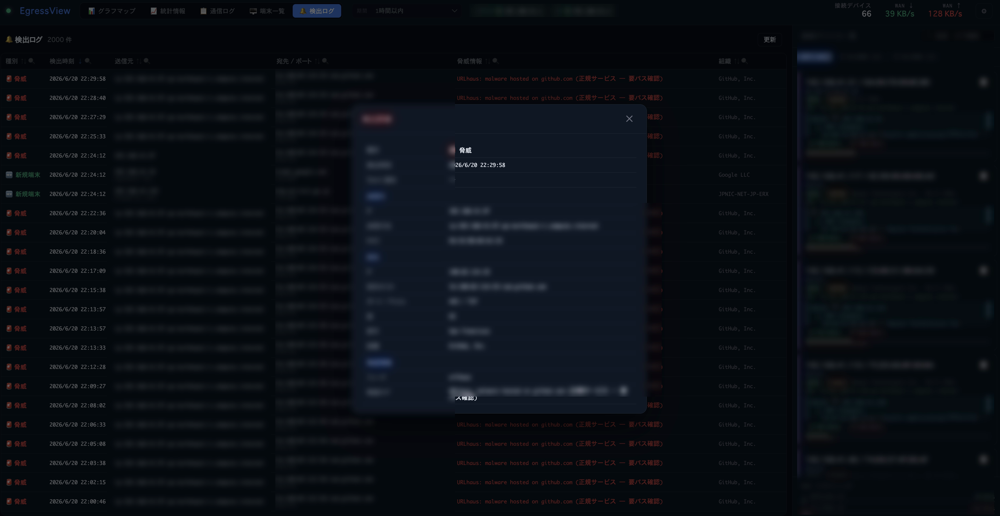
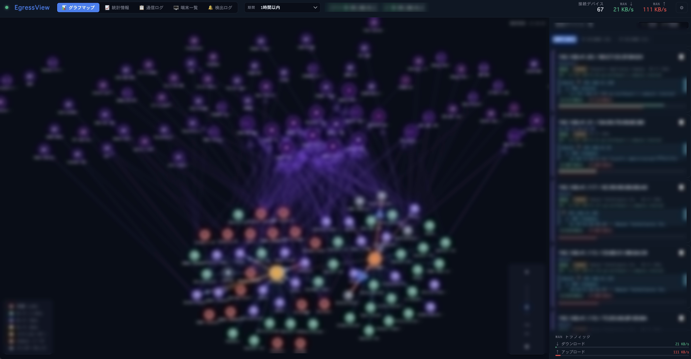
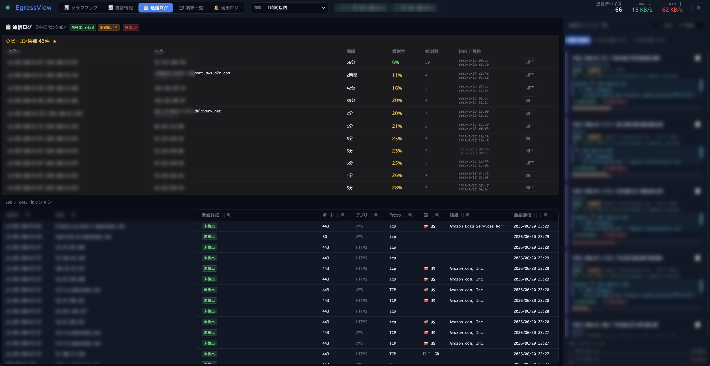

# EgressView

**家庭・SOHO向けネットワークセキュリティモニター — LAN内の全デバイスの通信先をリアルタイムに可視化**

スマートTVが見知らぬサーバーと通信していないか？IPカメラやIoT機器、NASが許可していない接続をしていないか？EgressViewは、LAN内の全デバイスが外部と行う通信をパッシブに監視し、そのデータを調査のための道具にします。

追加ハードウェア不要。通信の中継・傍受もしません。既存のYamaha RTXまたはCisco IOSルーターが既に持っているNATセッションテーブルを読むだけなので、**通信経路上に何も置かず、速度も落ちません**。


> 🇬🇧 [English README](README.md) | 🌐 [プロジェクトページ](https://yo1t.github.io/egressview/index.ja.html) | 📋 [変更履歴](CHANGELOG.md) · [リリース](https://github.com/yo1t/egressview/releases)

---

## 動いているところを見る

### ▶ 動作を見る

グラフマップと統計情報でネットワーク全体を見て、通信ログと端末一覧で怪しい宛先を掘り下げる — **実際の調査でたどる順序そのもの**です。UIは日本語／英語を切り替えられます。

https://github.com/user-attachments/assets/9448d75b-a7fe-4363-8d35-da17abaed0ee


*ある端末が既知のC2サーバーへ接続した瞬間。このツールが存在する理由がこれです。Slackを設定していなくても記録は残ります。*


*どの端末がどこへ通信したかを一望します。自分が設定した覚えのない塊が、最初に見るべき場所です。*


*疑いから個々のセッションへ。期間で絞り、並べ替え、列ごとに検索して、その通信をした端末へ辿れます。*

### ルーターなしで試す

ハードウェアに一切触れる前に、サンプルデータで画面全体を動かせます。**自分の時間を使う価値があるかを最短で判断できます。**

```bash
git clone https://github.com/yo1t/egressview.git
cd egressview && npm install
DEMO_MODE=true DEMO_ADMIN_TOKEN=my-token npm start
```

`http://localhost:3000` を開いて `my-token` を入力してください。160件の現実的な接続が入り、すべての画面が動作します。ヘッダーに **DEMO** バッジが出るので、実運用と取り違えることはありません。

---

## 何ができるか

**どの端末が、どこと通信しているかが分かります。** すべての接続が送信元の端末に紐づきます。OUI・mDNS/Bonjour・SSDP・NetBIOS・200機種のApple辞書からベンダー名・機種名・ホスト名を解決するため、**怪しい通信先が「調べないと分からないIP」ではなく「その通信をした機器の名前」とセットで出てきます。**

**危険と分かっている先へ接続したら警告します。** すべての接続をFeodo Tracker・ThreatFox・URLhaus・Spamhaus DROPと毎時更新のフィードで照合します。結果は 🚨 検出 / ⚠️ 要確認 / ✅ 問題なし の3段階です。マルウェアも置かれているCDNとボットネットの指令サーバーは別物であり、**同じ扱いにすると警告を無視する習慣がつくためです。**

**画面を見ていないときにも届きます。** 既知のC2やマルウェア配布ホストへ接続した瞬間にSlack DMが飛びます。宛先ごとのクールダウンがあるので、1つの騒がしい宛先で埋め尽くされることはありません。脅威検出と新規端末検出は、Slackと画面内履歴のスイッチが独立しています。**片方を静かにしても、もう片方の記録は残せます。**

**証拠が残ります。** 接続はSQLite（WAL・クラッシュ耐性あり・保持期間は最長2年まで設定可）に蓄積され、検出ログには脅威と新規端末の記録が列ごとのフィルタと詳細表示つきで残ります。**「これはいつから起きていたのか」に答えられます。**

**通信先を「アドレス」ではなく「名前」で示します。** 各宛先を逆引きDNS・RDAP（組織名）・GeoIPで補強し、dnsmasqのクエリログがあれば端末が実際に問い合わせたホスト名を使います。Appカラムはポートと宛先からサービス名を推定します（APNs・iCloud・QUIC・MQTT/TLS・AirPlay・YouTube・AWS・Slack・Zoom など）。**通常の通信が自分から名乗るので、異常が浮き上がります。**

**60秒ポーリングの隙間も拾います。** Yamahaの`[INSPECT]`syslogを常時読み、ポーリングの合間に開いて閉じた短命TCPセッションを捕まえます。`[DHCPD]`イベントでIP↔MAC対応をリース変更に追従させます。

**ルーターは1台でなくて構いません。** Yamaha・Ciscoを任意の組み合わせで最大10台。それぞれ独立してポーリングするため、**1台が応答しなくても他は止まりません。** 複数のルーターから見えた接続は1件として保存し、観測したルーターをすべて保持します。

**ルーターからは見えないMacの中身も見えます。** ルーターは「何が外へ出たか」は見せますが「どのアプリが出したか」は見せません。[EgressView Agent for macOS](apps/agent-macos/README.md)が接続元のプロセスを報告します。メタデータのみで、通信内容は読みません。

**自然言語で質問できます。** 内蔵MCPサーバーが11本のツールをAWS Kiro・Anthropic Claude・Anysphere Cursor等へ公開するので、「192.168.1.50 が今週どこへ接続したか」をそのまま聞けます。画面内の **AI Insights** は収集状況・通信量・脅威・前期間比較から始まります。

**スマートフォンからも使えます。** ルーターの状態・グラフマップ・統計情報・通信ログ・端末一覧・検出ログを、VPNや private network 経由で確認できます。

**任意: Wi-Fi端末に名前がつきます。** ASUSアクセスポイント（APモードまたはAiMesh）を繋ぐと、無線端末の周波数帯・電波強度・通信レート・メッシュ構成が加わります。

**任意: 特定のアドレスを明示的に調べられます。** AbuseIPDB・VirusTotal・AlienVault OTXへは、**あなたが明示的に指示したときだけ**問い合わせます。サーバー側キャッシュとレート制限つきです（[ガイド](docs/manual-threat-investigation.ja.md)）。

---

## 自分の環境で動くか

**Yamaha RTXかCisco IOSのルーターが必要です。** パケットキャプチャ方式もインライン方式もありません。

**macOS Agentだけの構成は、1台のMacをカバーするものであってネットワークをカバーするものではありません。** ルーターが無くても動作し、Agentが報告した通信には**脅威照合・宛先の補強・検出ログ・Slack通知がすべて適用されます。** フロー発生時に捕まえるためポーリング間隔による取りこぼしもなく、どのアプリが接続したかも分かります。

得られないのは**家の残り**です。LAN内の他の機器は一切見えません。**Agentは1台のマシンについて全部を教えてくれます。ルーターは、ソフトウェアを入れられない20台について教えてくれるものです。**

| | 必要なもの |
|--|-----------|
| ✅ | **Node.js 22以降** — 常時起動しておけるMac・PC・Raspberry Piのいずれか |
| ✅ | **Yamaha RTXまたはCisco IOSルーター1台以上**（SSH有効）（[Yamaha](docs/setup-yamaha.ja.md) · [Cisco](docs/setup-cisco.ja.md)） |
| ☐ | 任意: **ASUSアクセスポイント**（AP/AiMeshモード）— Wi-Fi端末の詳細用（[設定](docs/setup-asus.ja.md)） |

**Yamaha RTX** — SSHとNAT descriptorに対応した機種: RTX1200・RTX1210・RTX1220・RTX1300・RTX810・RTX830・NVR500・NVR510・NVR700W。

**Cisco IOS** — C841M-4X-JSEC/K9（IOS 15.5(3)M9）で実機検証済み。SSH・enable・NAT/ARP/NDP・verbose出力・TOFU・自動再接続を含みます。

**Linuxルーター** — SSH経由のconntrack収集はプレビューです。Dockerでの検証は済んでいますが、**実機での検証は未了です**（[設定](docs/setup-conntrack.ja.md)）。

**マルチルーターで実証できていること・できていないこと。** 自動テストでは、10台の混在した擬似ルーターを各1,000セッションで動かし、障害の分離と決定的な重複排除を確認しています。実機では、Cisco 1台とYamaha 1台をそれぞれ別のルーターIDで二重登録して確認しました。**ここまでで実証できるのは並列収集と重複排除です。** HSRP/VRRP、NAT状態の同期、実際のフェイルオーバーは**実証していません**。同一ベンダーの異なる実機を複数台という構成も実機確認していません。機種ごとの出力差はGitHub Issuesでご報告ください。

---

## セットアップ

**所要およそ15分。そのほとんどはルーター側の作業です。** ソフトウェア側は実測7秒でした（clone 0.9秒、`npm install` 4.0秒、起動から準備完了まで2秒）。時間がかかるのは、まだSSHを有効にしていないルーターにログインできるようにする作業です。

自分のネットワークに合う最小の構成から始めてください。データ源は後から設定画面で追加でき、やり直しは発生しません。

| 構成 | こういう場合 |
|------|-------------|
| Yamaha RTXかCisco IOSを1台 | まず最短で動かしたい |
| ルーター最大10台 | 冗長構成や複数回線がある |
| ＋ ASUS AP | Wi-Fi端末の名前・ベンダー・MACも見たい |
| ＋ dnsmasq / INSPECT / DHCPD | 実際のホスト名、短命セッション、リアルタイムのIP↔MAC対応が欲しい |
| ＋ Slack | 検出をDMで受け取りたい |

### 1. インストールして起動する

```bash
git clone https://github.com/yo1t/egressview.git
cd egressview
npm install
npm start
```

### 2. ログインする

ログインパスワードは、対話端末に**1回だけ**表示されます。サービス起動など非対話の場合は、**永続的なログに残さず**`.egressview.json.initial-login-password`（パーミッション`0600`）へ書き出します。

```
══════════════════════════════════════════════════════════════
  EgressView login password (initial):
  KFpDqntYRfcr...
  → Log in with this password on first access
══════════════════════════════════════════════════════════════
```

`http://localhost:3000` を開いて入力します。ブラウザごとに個別のセッション（30日スライド式）が作られ、設定 → 一般 で確認・失効できます。ログインできたら、一度きりのパスワードファイルは削除してください。

### 3. ルーターを登録する

設定 → **L3/L4** で、ルーター1台につき1行を追加します。[Yamaha](docs/setup-yamaha.ja.md)または[Cisco](docs/setup-cisco.ja.md)のガイドで用意したLAN IPとSSHログインを入力し、**接続して自動検出**を押します。

自動検出はSSH接続、NAT descriptor（通常`100`）、LANアドレスを調べ、**NATセッションが実際に読めるかまで確認します。保存する前に**です。パスワードが違えば画面を見ているその場で失敗するので、**何も収集していない状態に静かに陥ることがありません。**

### 4. 埋まっていくのを見る

数秒で端末・セッション・統計が現れます。必要な作業はここまでで、以下はすべて任意です。

---

## さらに使う

以下はすべて任意で、それぞれにガイドがあります。

| | |
|---|---|
| [macOS Agent](apps/agent-macos/README.md) | Macのどのアプリが、どこへ通信したかが地図で分かり、通信先が脅威フィードに載っているかも照合します（Hub 1.9.0以降が必要。脅威フィードはHub 1.10.0以降） |
| [AIアシスタント連携（MCP）](docs/setup-mcp.ja.md) | Claude・Kiro・Cursorから自然言語で質問できます。11本のツール、stdio / HTTP対応 |
| [AI Insights](docs/setup-ai-insights.ja.md) · [Bedrock](docs/setup-bedrock.ja.md) | Ollama・Anthropic・OpenAI・Amazon Bedrockによる要約と分析。月次のトークン数と概算コストを記録します |
| [認証とHTTPS](docs/authentication.ja.md) | セッション・Google OIDC・権限・監査ログ・TLSの有効化。**インターネットへ公開する前に必ず読んでください** |
| [設定](docs/configuration.ja.md) | ポート・データベースの場所・メモリ上限など、起動前に決まっている必要がある設定 |
| [アーキテクチャ](docs/architecture.ja.md) · [REST API](docs/api-reference.ja.md) | 構成要素の境界、データの流れ、自動化 |
| [配備プロファイル](docs/deployment-profiles.ja.md) | ローカル・プライベート・公開・完全オフライン。オフラインモードを含みます |
| [署名付き配布物](docs/offline-distribution.ja.md) | 署名済みの可搬リリースを`openssl`だけで検証してインストールします |
| [追加のデータ源](docs/setup-conntrack.ja.md) | dnsmasq・`[INSPECT]`・`[DHCPD]`・Linux conntrack |

---

## ライセンス

EgressViewはデュアルライセンスです。

- オープンソース: [GNU Affero General Public License v3.0](LICENSE)
- 商用: プロプライエタリ／クローズドソース用途向けに別途提供
- 同梱コンポーネント: [第三者ライセンス表示](THIRD_PARTY_NOTICES.md)

AGPL-3.0の下で使用・改変・配布できます。EgressViewまたはその派生物をプロプライエタリ製品に組み込む場合、ソースコードなしで配布する場合、改変版をネットワークサービスとして提供する場合は、AGPL-3.0のソースコード提供義務に従う必要があります。対応するソースを公開せずにプロプライエタリ製品で使用するには、著作権者からの商用ライセンスが必要です。

```
EgressView — Real-time network connection visualizer
Copyright (C) 2025 Yoichi Takizawa

Source code: https://github.com/yo1t/egressview
```

## 商標

AWS Kiro、Anthropic Claude、Anysphere Cursor、Cisco、Cisco IOS、Yamaha、ASUSその他の製品名は、各社の商標または登録商標です。EgressViewはこれらの企業と提携しておらず、推奨・後援も受けていません。

## コントリビューション

IssueとPull Requestを歓迎します。大きな変更はまずIssueを立ててください。開発環境の準備は[CONTRIBUTING.md](CONTRIBUTING.md)、今後の予定は[ROADMAP.md](ROADMAP.md)、脆弱性の非公開報告方法は[SECURITY.md](SECURITY.md)にあります。
