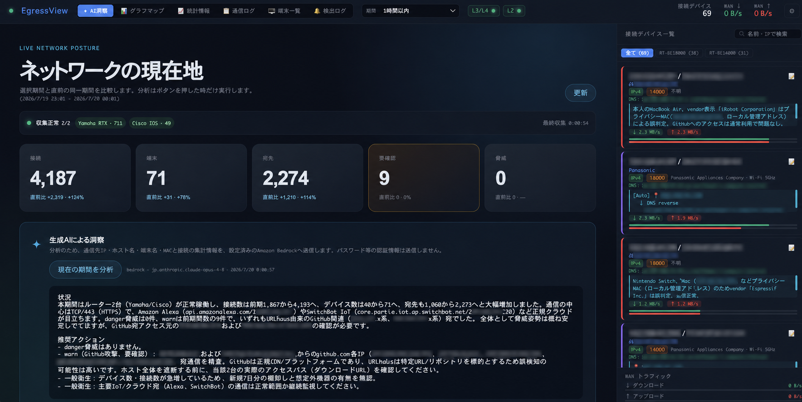
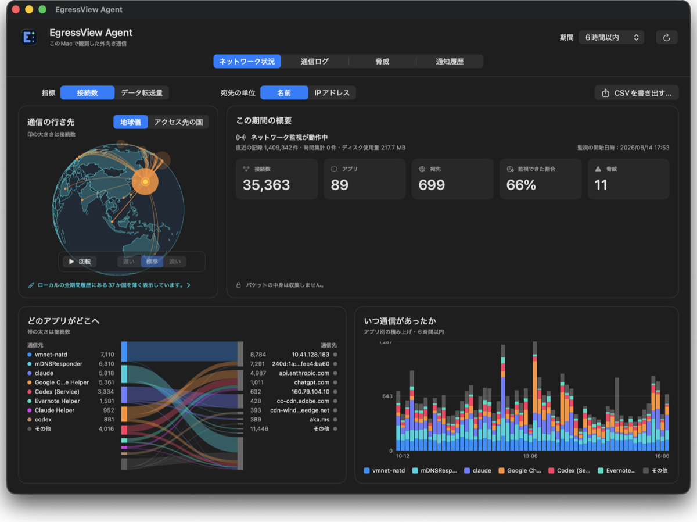

# EgressView

**通信先と、その通信を行ったアプリを見えるように。** EgressViewは家庭・SOHO向けのオープンソースのネットワーク可視化ツールです。Hubはルーター経由でネットワーク内の機器を、AgentはインストールしたMacまたはWindows PC自身の通信を観測します。単独でも使え、Agentの観測をHubへ送ることもできます。収集するのは接続のメタデータで、パケットの中身は収集しません。

[English](README.md) · [公式サイト](https://www.egressview.com/) · [Agentのダウンロード](https://dl.egressview.com/) · [リリース](https://github.com/yo1t/egressview/releases)

 

## どこから始める？

| | EgressView Hub | Agent for Mac | Agent for Windows |
|---|---|---|---|
| **見える範囲** | 対応ルーター配下の機器。ソフトウェアを入れられないTVやIoT機器も対象 | このMacの外向き通信と、その通信を行ったアプリ | このPCの外向き通信と、その通信を行ったアプリ |
| **必要なもの** | Node.js 22以降。ルーター収集にはYamaha RTXまたはCisco IOS | Mac。Hubもルーターも不要 | Windows PC。Hubもルーターも不要 |
| **最初の一歩** | [Hubを起動する](#hubを起動する) | [ダウンロード](https://dl.egressview.com/) · [Macガイド](apps/agent-macos/README.ja.md) | [ダウンロード](https://dl.egressview.com/) · [Windowsガイド](apps/agent-windows/README.md) |

HubはルーターなしでもAgentの観測を受け取れます。Agent単独なら記録はその端末に残り、Hubへの送信は明示的に有効化した場合だけ行います。**Agentが見られるのはインストールした端末だけ**です。ルーターならソフトウェアを入れられない機器も見えますが、PC上のどのアプリが送信したかは分かりません。

## 画面を見る

### Hub: ネットワーク全体を把握



Yamaha RTXとCisco IOSを任意に組み合わせ、最大10台から収集できます。同じ通信を複数のルーターが見ても1件として保存し、SQLiteに履歴を残します。グラフマップ、通信・端末一覧、脅威検出、任意のAI分析を利用できます。[グラフマップの画像](docs/assets/egressview-graph-map.png) · [構成の説明](docs/architecture.ja.md)

### Agent for Mac: このMacの通信を把握



Hubを設置しなくても、宛先・アプリ名・データ量・ローカル履歴を確認できます。必要になれば後からHubへの送信を有効にできます。[導入方法と監視の承認](apps/agent-macos/README.ja.md) · [Agentが送る情報](docs/agent-privacy.ja.md)

### Agent for Windows: このPCの通信を把握


Windowsサービスが通信を観測し、そのPC内に履歴を残します。Hubへの送信は任意です。**現在のWindows配布物はAuthenticode未署名**のため、SmartScreenが発行元不明と警告する場合があります。インストール前に[ダウンロードページの手順](https://dl.egressview.com/)でMSIのチェックサムを照合してください。[Windows導入ガイド](apps/agent-windows/README.md) · [Agentが送る情報](docs/agent-privacy-windows.ja.md)

## 試してみる

**Mac・Windows:** [Agentダウンロードページ](https://dl.egressview.com/)でOSを選び、上記のガイドに沿って導入してください。Agent単独ならNode.jsもルーターも不要です。

**Hubのデモ（ルーター不要）:**

```bash
git clone https://github.com/yo1t/egressview.git
cd egressview
npm install
DEMO_MODE=true DEMO_ADMIN_TOKEN=my-token npm start
```

`http://localhost:3000` を開き、`my-token`でログインします。サンプル通信を使うデモであり、実際のネットワークは監視しません。画面には **DEMO** と表示されます。

### Hubを起動する

Node.js 22以降を用意します。ルーターのSSHへ到達できるマシンで、次を実行してください。

```bash
git clone https://github.com/yo1t/egressview.git
cd egressview
npm install
npm start
```

`http://localhost:3000`を開きます。初回のローカル管理者パスワードは対話端末に一度だけ表示されます。非対話起動時は、パーミッション`0600`の`.egressview.json.initial-login-password`に書かれるので、ログイン後に削除してください。**設定 → L3/L4**でルーターを追加し、**接続して自動検出**でSSHとNATセッションの取得を保存前に確認します。[Yamahaの設定](docs/setup-yamaha.ja.md) · [Ciscoの設定](docs/setup-cisco.ja.md)

Linuxルーターのconntrack収集は[プレビュー](docs/setup-conntrack.ja.md)で、実機検証は未了です。複数ルーターの収集・重複排除は自動テスト済みですが、複数実機でのHSRP/VRRP切替やNAT状態同期は**検証していません**。

## さらに使う

| 用途 | ガイド |
|---|---|
| AI洞察と任意のモデル | [AI洞察](docs/setup-ai-insights.ja.md) · [Amazon Bedrock](docs/setup-bedrock.ja.md) |
| MCP経由でAIアシスタントから質問 | [MCP設定](docs/setup-mcp.ja.md) |
| HTTPS・アカウント・外部公開 | [認証](docs/authentication.ja.md) · [配備プロファイル](docs/deployment-profiles.ja.md) |
| 脅威通知と手動調査 | [脅威の調査](docs/manual-threat-investigation.ja.md) |
| 設定・API・オフライン配布 | [設定](docs/configuration.ja.md) · [REST API](docs/api-reference.ja.md) · [署名付き配布物](docs/offline-distribution.ja.md) |

## ライセンス

EgressViewはデュアルライセンスです。

- オープンソース: [GNU Affero General Public License v3.0](LICENSE)
- 商用: プロプライエタリ／クローズドソース用途向けに別途提供
- 同梱コンポーネント: [第三者ライセンス表示](THIRD_PARTY_NOTICES.md)

AGPL-3.0の下で使用・改変・配布できます。EgressViewまたはその派生物をプロプライエタリ製品に組み込む場合、ソースコードなしで配布する場合、改変版をネットワークサービスとして提供する場合は、AGPL-3.0のソースコード提供義務に従う必要があります。対応するソースを公開せずにプロプライエタリ製品で使用するには、著作権者からの商用ライセンスが必要です。

```
EgressView — Real-time network connection visualizer
Copyright (C) 2025 Yoichi Takizawa

Source code: https://github.com/yo1t/egressview
```

## 商標

AWS Kiro、Anthropic Claude、Anysphere Cursor、Cisco、Cisco IOS、Yamaha、ASUSその他の製品名は、各社の商標または登録商標です。EgressViewはこれらの企業と提携しておらず、推奨・後援も受けていません。

## コントリビューション

IssueとPull Requestを歓迎します。大きな変更はまずIssueを立ててください。開発環境の準備は[CONTRIBUTING.md](CONTRIBUTING.md)、今後の予定は[ROADMAP.ja.md](ROADMAP.ja.md)、脆弱性の非公開報告方法は[SECURITY.md](SECURITY.md)にあります。
