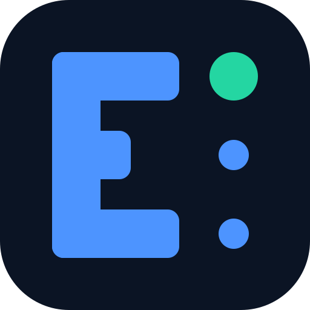
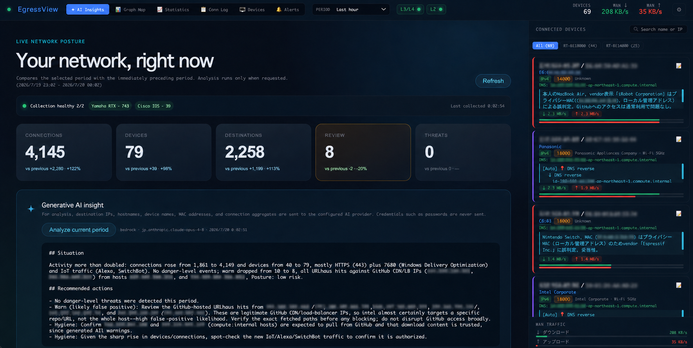
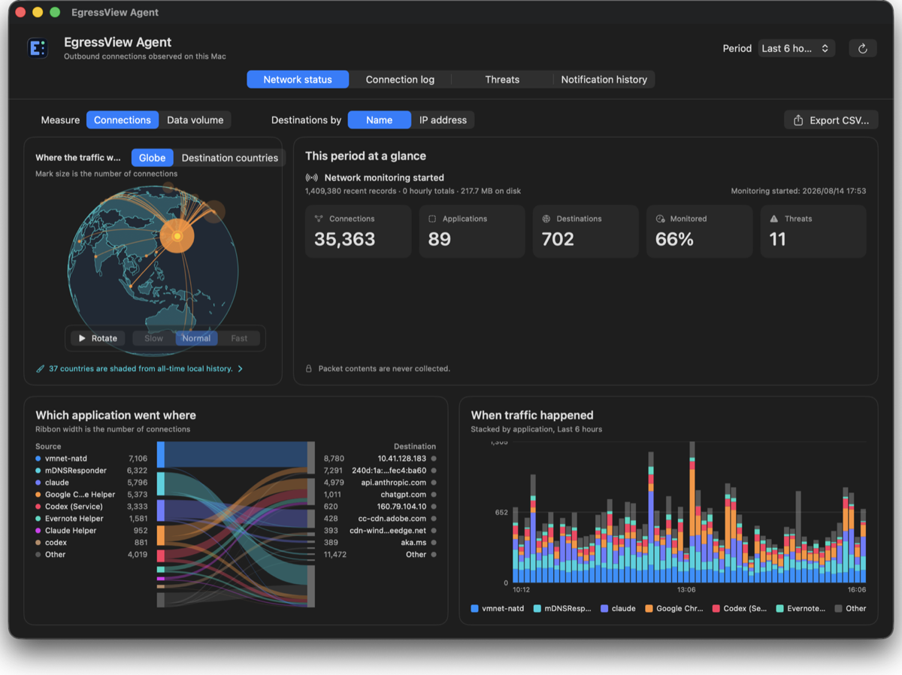
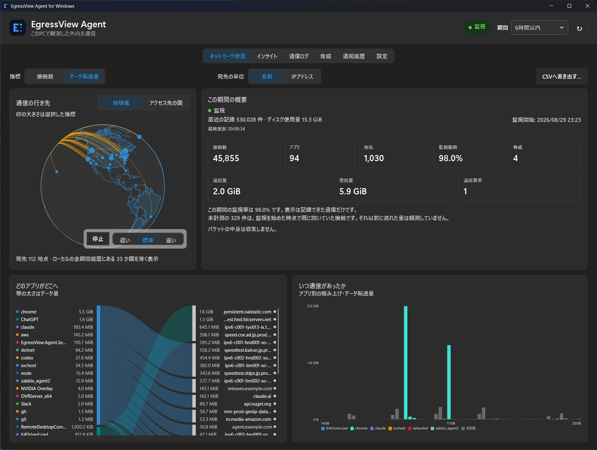

# EgressView

**See where your network traffic goes, and which app sent it.** EgressView is an open-source network visibility toolkit for homes and small offices. The Hub sees devices through your router; an Agent watches its own Mac or Windows PC. Use either on its own, or send Agent observations to the Hub for a wider view. Only connection metadata is collected, never packet contents.

[日本語](README.ja.md) · [Website](https://www.egressview.com/) · [Agent downloads](https://dl.egressview.com/) · [Releases](https://github.com/yo1t/egressview/releases)

 

## Choose your starting point

| | EgressView Hub | Agent for Mac | Agent for Windows |
|---|---|---|---|
| **What it sees** | Devices behind a supported router, including TVs and IoT devices | Outbound connections and originating apps on this Mac | Outbound connections and originating apps on this PC |
| **What you need** | Node.js 22+; a Yamaha RTX or Cisco IOS router for router-based collection | A Mac; no Hub or router required | A Windows PC; no Hub or router required |
| **Start here** | [Run the Hub](#run-the-hub) | [Download and install](https://dl.egressview.com/) · [Mac guide](apps/agent-macos/README.md) | [Download and install](https://dl.egressview.com/) · [Windows guide](apps/agent-windows/README.en.md) |

The Hub can also receive observations from Agents without a router. Agents keep a local record when used alone; sending observations to a Hub is opt-in. An Agent sees **only its own computer**, not every device on the LAN. A router sees devices without installed software, but cannot identify the sending process on a computer.

## See the products

### Hub: the network-wide view



Collect from up to ten Yamaha RTX or Cisco IOS routers in any combination. The Hub combines observations of the same connection, retains history in SQLite, and provides a graph map, connection and device views, threat detections, and optional AI analysis. [More Hub screenshots](docs/assets/egressview-graph-map.png) · [Architecture](docs/architecture.md)

### Agent for Mac: what happened on this Mac



See destinations, application names, data volume, and local history without deploying a Hub. You can opt in to Hub delivery later. [Mac setup and monitoring permissions](apps/agent-macos/README.md) · [What the Agent sends](docs/agent-privacy.md)

### Agent for Windows: what happened on this PC



The Windows Agent runs a local monitoring service and shows its own connection history; Hub delivery is optional. The screenshot shows the Japanese interface. **Windows downloads are not yet Authenticode-signed:** SmartScreen may warn about an unknown publisher. Verify the MSI checksum using the [download-page instructions](https://dl.egressview.com/) before installing. [Windows setup](apps/agent-windows/README.en.md) · [What the Agent sends](docs/agent-privacy-windows.md)

## Try it

**Mac or Windows:** Visit the [Agent download page](https://dl.egressview.com/), choose your operating system, and follow the corresponding setup guide above. Neither Node.js nor a router is required for standalone Agent use.

**Hub demo, no router needed:**

```bash
git clone https://github.com/yo1t/egressview.git
cd egressview
npm install
DEMO_MODE=true DEMO_ADMIN_TOKEN=my-token npm start
```

Open `http://localhost:3000` and log in with `my-token`. Demo mode uses sample connections and is marked **DEMO**; it does not monitor your network.

### Run the Hub

Install Node.js 22 or later. On a machine that can reach your router over SSH:

```bash
git clone https://github.com/yo1t/egressview.git
cd egressview
npm install
npm start
```

Open `http://localhost:3000`. On first start, the local admin password appears once in an interactive terminal. A non-interactive start writes it to `.egressview.json.initial-login-password` with mode `0600`; delete that one-time file after logging in. In **Settings → L3/L4**, add a router and use **Connect & Auto-detect** to check SSH and NAT-session access before saving. [Yamaha setup](docs/setup-yamaha.md) · [Cisco setup](docs/setup-cisco.md)

Linux-router conntrack collection is a [preview](docs/setup-conntrack.md), not yet verified on physical hardware. Multi-router collection and deduplication have automated tests; actual HSRP/VRRP failover and NAT-state synchronization have **not** been validated on multiple physical routers.

## Explore further

| Topic | Guide |
|---|---|
| AI Insights and optional model providers | [AI Insights](docs/setup-ai-insights.md) · [Amazon Bedrock](docs/setup-bedrock.md) |
| AI assistant access through MCP | [MCP setup](docs/setup-mcp.md) |
| HTTPS, accounts, and public deployment | [Authentication](docs/authentication.md) · [Deployment profiles](docs/deployment-profiles.md) |
| Alerts and manual threat investigation | [Threat investigation](docs/manual-threat-investigation.md) |
| Configuration, API, and offline packages | [Configuration](docs/configuration.md) · [REST API](docs/api-reference.md) · [Signed distributions](docs/offline-distribution.md) |

## License

EgressView is dual-licensed.

- Open source: [GNU Affero General Public License v3.0](LICENSE)
- Commercial: available separately for proprietary or closed-source use
- Bundled components: [third-party notices](THIRD_PARTY_NOTICES.md)

You may use, modify, and distribute EgressView under the AGPL-3.0. If you include EgressView or derivative works in a proprietary product, distribute it without source code, or provide a modified version as a network service, you must comply with the AGPL-3.0 source code obligations. To use it in a proprietary product without releasing the corresponding source, you need a commercial license from the copyright holder.

```
EgressView — Real-time network connection visualizer
Copyright (C) 2025 Yoichi Takizawa

Source code: https://github.com/yo1t/egressview
```

## Trademarks

AWS Kiro, Anthropic Claude, Anysphere Cursor, Cisco, Cisco IOS, Yamaha, ASUS, and other product names are trademarks or registered trademarks of their respective owners. EgressView is not affiliated with, endorsed by, or sponsored by those companies.

## Contributing

Issues and pull requests are welcome. Please open an issue first for major changes. See [CONTRIBUTING.md](CONTRIBUTING.md) for development setup, [ROADMAP.md](ROADMAP.md) for what is planned, and [SECURITY.md](SECURITY.md) for how to report vulnerabilities privately.
