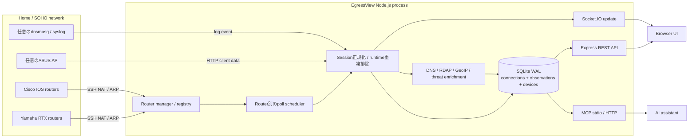

# EgressView アーキテクチャ

> [English](architecture.md)

本書では、router障害の分離、観測元の保持、databaseの安全性、API securityを支える本番アーキテクチャを説明します。

## システム全体

## 収集とrouter障害の分離

各routerは、不変の`routerId`、共通poller契約を実装したYamaha/Cisco adapter、独立したscheduler状態を持ちます。Yamaha/Ciscoを任意に混在して最大10台登録できます。

汎用schedulerは初回pollを分散し、1回ごとのtimeout、連続失敗時のbackoff、router単位の開始・停止を管理します。1台が利用不能でも正常なrouterの収集は継続します。Adapterはvendor固有のSSH commandとNAT/ARP出力を共通session形式へ変換し、その後の処理を共有します。

Runtime上の自然keyは`(src, dst, dport, proto)`です。同じ通信を複数routerが観測した場合、connectionは重複排除し、全観測元を`connection_observations`へ保存して、安定したIDの`observedBy`として公開します。削除したrouter IDはtombstoneとして残るため、過去データの帰属は変わりません。

## Data flow

1. Router adapterが通常60秒ごとにSSHでNAT sessionとaddress-neighbor情報を取得します。
2. 任意のINSPECT、DHCPD、dnsmasq、ASUS sourceが短命session、IP/MAC対応、hostname、Wi-Fi metadataを補います。
3. Runtimeが反復観測を統合し、reverse DNS、RDAP、GeoIP、OUI/端末識別、threat intelligenceの付加処理を開始します。
4. Connection履歴とrouter観測を同じSQLite transactionで一括保存します。BrowserはSocket.IOで差分を受け取り、RESTで永続履歴を検索します。
5. 検出、beacon、端末、通知moduleが同じ永続データから上位の情報を生成します。

## 永続化と起動

EgressViewは1つのSQLite databaseをWAL modeで使用し、history、sessions、devices、enrichment、beaconsが個別のconnectionを持ちます。`db-bootstrap.js`が明示的な起動境界です。Schema migrationを所有するhistoryを最初に開き、migration成功後にだけ他の利用者を開きます。

Migrationは末尾追加方式でfail-closedです。データ変更を伴うmigrationの前に空き容量を検査し、整合性を検証したbackupを作成してからtransactionを実行し、完了後のdatabaseも検証します。Restoreも同じ原則で、復元元検査、安全backup必須、置換、全利用者の再接続、復元後検査を行い、どこかで失敗すればrollbackします。

Backup cleanupのpreviewと実行は専用worker threadで行います。SQLiteのintegrity checkは同期処理で数GBを走査する可能性があるためです。Main processはcleanupを同時1件に制限し、進捗、cancel、timeout状態を公開します。Workerでも検証済み世代の最低保持条件と削除直前の再検証を維持し、event loopから分離してもfail-closed条件は緩めません。

Schema v5ではrouterの観測情報を`connection_observations`だけに保存し、旧`connections.source` columnは削除済みです。APIの互換用`source`値は、観測したrouterのkindから導出します。Observation consistency診断では観測漏れ、孤立した観測、router metadataの欠落を検査します。Schema v6はappend-only AI会話、v7はproviderが返したtoken使用量と呼び出し時点のUSD概算、v8は定期・脅威発火・手動・通知テストのAI通知eventをappend-only保存します。検証済み`src/data/ai-pricing.json`が版管理単価と根拠情報を提供し、各usage行は呼び出し時点の単価を保持します。過去会話、未知model、usage未返却の料金は推測しません。

## Interface

- **Browser UI:** AI洞察をスタートページにしたstatic single-page applicationと認証済みSocket.IO update。
- **REST:** `/api`配下の管理・検索API 71本と、最小情報だけを返す`/healthz`・`/readyz`。[REST APIリファレンス](api-reference.ja.md)を参照してください。
- **AI provider:** Ollama / Anthropic / OpenAI / Amazon Bedrockへの明示操作型read-only分析。設定とprivacy境界は[AI洞察設定ガイド](setup-ai-insights.ja.md)を参照してください。
- **MCP:** stdioまたは認証済みHTTPで利用する11本のread/write tool。SDK v2の
  1つのfactoryがlegacy `2025-11-25` initialize flowとstateless
  `2026-07-28` discover flowをtool差分なしで提供します。公開OAuth stagingは
  DNSやinfraを変更しないfail-closed dual-era公開gateで保護します。
  [MCP設定ガイド](setup-mcp.ja.md)を参照してください。
- **Export:** 履歴全体をmemoryへ載せない、上限付きstreaming CSV/JSON。
- **通知:** 任意のSlack送信。Slack無効時も検出結果はlocal notification logへ保存します。

## Security boundary

- RouterのSSH接続先はRFC 1918 private IPv4 addressに限定します。SSH host keyはTOFUで保存し、fingerprint変化を検出します。
- Router credentialとtokenはlocalのmode `0600`設定ファイルへ保存し、APIは`passSet`/`enablePassSet`だけを返します。
- Login、token検証、詳細情報を返さないhealth/readiness以外のREST APIは`X-Admin-Token`必須です。Socket.IOも同じ認証方針です。
- ServerはCSP、clickjacking防止、MIME sniffing防止、referrer制限を設定し、TLS利用時はHSTSも有効にします。
- EgressViewはinline装置ではありません。収集失敗はroutingを止めず、1台のrouter障害が他のcollectorを止めません。
- EgressViewはHTTPSまたは信頼できるVPN内だけで公開し、application、router管理画面、backup fileをInternetへ直接公開しないでください。

## Code map

| 責務 | 主な実装 |
|---|---|
| Process wiring / readiness / lifecycle | `server.js`, `src/health-state.js` |
| HTTP構成と保護 | `src/http-app.js`, `src/routes/` |
| 複数router lifecycle | `src/router-manager.js`, `src/router-registry.js` |
| Poll scheduling | `src/router-poll-scheduler.js` |
| Vendor adapter | `src/pollers/yamaha-adapter.js`, `src/pollers/cisco-adapter.js` |
| Runtime正規化・重複排除 | `src/runtime.js` |
| 履歴・観測のread/write | `src/history.js` |
| DB bootstrap / migration | `src/db-bootstrap.js`, `src/db-migrate.js` |
| Backup inventory・worker job・prune・restore | `src/backup-inventory.js`, `src/backup-prune-runner.js`, `src/backup-prune-worker.js`, `src/backup.js`, `src/routes/backup.js` |
| Browser module | `public/js/` |
