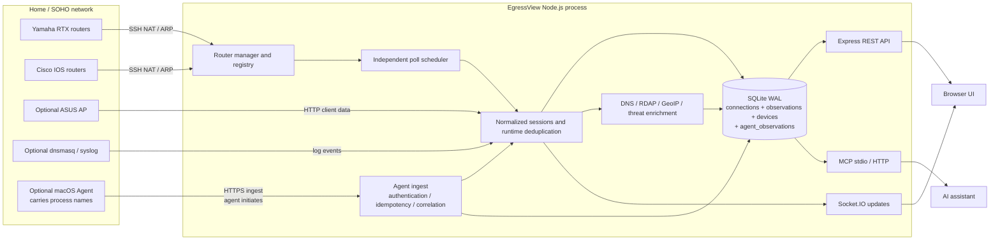

# EgressView Architecture

> [Japanese / 日本語](architecture.ja.md)

This document describes the production architecture and the boundaries that preserve router isolation, observation attribution, database safety, and API security.

The application core is cloud-neutral. See [Deployment profiles](deployment-profiles.md)
for the local stdio, private HTTP, private OAuth, and public OAuth boundaries,
including the planned air-gapped profile.

## System view

**Agent batches join the same normalization path, and that is a requirement rather than a convenience.** Threat matching, enrichment, device tracking, and notifications all operate over `connections`; an observation that does not become one is listed without ever being checked, which on screen is indistinguishable from having been checked and found safe.

## Collection and router isolation

Each configured router has an immutable `routerId`, a Yamaha or Cisco adapter that implements the common poller contract, and an independent scheduler state. EgressView supports up to 10 routers in any Yamaha/Cisco mix.

The generic scheduler staggers initial polls, enforces a per-cycle timeout, backs off repeated failures, and lets healthy routers continue when another router is unavailable. Adapters translate vendor-specific SSH commands and NAT/ARP output into the same normalized session shape before shared processing begins.

The runtime natural key is `(src, dst, dport, proto)`. When multiple routers see the same communication, EgressView deduplicates the connection while preserving every observer in `connection_observations` and exposing those stable IDs as `observedBy`. Deleted router IDs remain as tombstones so history never changes ownership.

## Endpoint agents

A router shows what left the house but not **which application sent it**. The macOS agent fills exactly that gap.

- **The agent always initiates.** The Hub never polls an endpoint, so a laptop away from home needs no inbound path and the Hub needs no hole in its firewall.
- **Enrolment requires an administrator.** A machine applies with a six-character code and receives a credential only after someone approves it in the web UI. The host name in an application is **claimed by the client**, and the approval screen says so.
- **Delivery is idempotent.** Re-sending the same `batchId` creates no duplicates, so a machine that lost an acknowledgement simply sends the batch again.
- **Correlation is by 5-tuple.** A flow seen by both a router and an agent is stored once, with the association kept in `connection_agent_observations`; neither observer is lost.
- **The process name lands in `connections.process`.** A later router poll writes `NULL` there, because a router cannot know it, and the upsert keeps the value the agent supplied.

**An agent supplements a router rather than replacing one.** For its own machine it misses less than a router does — flows arrive as they happen, with no 60-second gap — but it sees nothing else on the LAN.

## Data flow

1. Router adapters collect NAT sessions and address-neighbor information over SSH, normally every 60 seconds.
2. Optional INSPECT, DHCPD, dnsmasq, and ASUS sources add short-lived sessions, IP/MAC identity, hostnames, and Wi-Fi metadata.
3. Optional endpoint agents deliver the flows they observed, each carrying its process name (`POST /api/agent/ingest`). An accepted batch enters **the same normalization path a router poll uses**.
4. The runtime merges repeated observations and queues reverse DNS, RDAP, GeoIP, OUI/device discovery, and threat-intelligence enrichment.
5. Connection history and its router observations are written atomically in one SQLite transaction. The browser receives deltas through Socket.IO and can query durable history through REST.
6. Detection, beacon, device, and notification modules derive higher-level findings from the same durable data, **whether a router or an agent observed it**.

## Persistence and startup

EgressView uses one SQLite database in WAL mode with separate module connections for history, sessions, devices, enrichment, and beacons. `db-bootstrap.js` is the explicit startup boundary: history owns schema migration and opens first; all other consumers open only after migration succeeds.

Migrations are append-only and fail-closed. Before a data-changing migration, EgressView checks free space, creates and validates a consistent backup, runs the migration transaction, and verifies the resulting database. Backup restore follows the same principle: validate source, require a safety backup, replace, reopen all consumers, validate the result, and roll back if any stage fails.

Backup cleanup preview and execution run in a dedicated worker thread. Planning reads only each recognized backup's fixed 100-byte SQLite header, so runtime is based on the number of generations rather than database size. Unusable files do not count toward retention; the newest usable restore points are protected, and candidate metadata plus header state is revalidated immediately before deletion. Full integrity checks remain at creation and restore boundaries.

Schema v5 stores router ownership only in `connection_observations`; the legacy `connections.source` column has been removed. API responses still expose a compatibility `source` value derived from the observer router kinds. The observation-consistency diagnostic checks for missing or orphaned observations and missing router metadata. Schema v6 stores append-only AI conversations; v7 stores provider-reported token usage and the USD estimate calculated at request time; v8 stores append-only scheduled, threat-triggered, manual, and delivery-test AI notification events. The validated `src/data/ai-pricing.json` catalog supplies versioned rates and source metadata, while each usage row preserves its invocation-time rates. EgressView does not infer costs for older conversations, unknown models, or responses without usage.

## Interfaces

- **Browser UI:** static single-page application with AI Insights as the start page plus authenticated Socket.IO updates.
- **REST:** 71 administration and query endpoints rooted at `/api`, plus minimal `/healthz` and `/readyz`; see the [REST API reference](api-reference.md).
- **AI providers:** explicit-action, read-only analysis through Ollama, Anthropic, OpenAI, or Amazon Bedrock; see the [AI Insights setup guide](setup-ai-insights.md) for configuration and privacy boundaries.
- **MCP:** 11 read/write tools over stdio or authenticated HTTP. One SDK v2
  factory serves the legacy `2025-11-25` initialize flow and the stateless
  `2026-07-28` discover flow without tool drift. Public OAuth staging is
  protected by a fail-closed dual-era publication gate that does not modify
  DNS or infrastructure; see the [MCP setup guide](setup-mcp.md). The selected
  runtime boundary is validated by `src/deployment-profile.js`; AWS is one
  public-profile adapter rather than a core dependency.
- **Exports:** bounded streaming CSV/JSON output to avoid loading an unbounded history into memory.
- **Notifications:** optional Slack delivery; detections remain in the local notification log even when Slack is disabled.

## Security boundaries

- Router SSH targets must be RFC 1918 private IPv4 addresses. SSH host keys use trust-on-first-use and saved fingerprints detect unexpected changes.
- Router credentials and tokens stay in the local mode-`0600` configuration file; API responses expose only `passSet`/`enablePassSet` flags.
- All REST endpoints except login, token verification, and the detail-free health/readiness checks require `X-Admin-Token`. Socket.IO applies the same authentication policy.
- The server sets CSP, clickjacking, MIME-sniffing, and referrer protections; HSTS is enabled when TLS is configured.
- **Only the Hub can revoke an agent credential.** Disabling delivery on the client stops it sending; the token stays valid. The UI keeps the two apart rather than letting one be mistaken for the other.
- **Agents require HTTPS by default.** Plaintext off loopback is permitted only after an explicit acceptance that lists what it exposes: the connection inventory, the credential sent with every batch, and the ability to submit forged observations.
- **Agent ingest authenticates before the body is read.** A caller with no credential is refused after the headers rather than after 512 KiB, and ingest holds a per-address budget separate from the general write limit.
- EgressView is not an inline network device. Polling failure does not interrupt routed traffic, and one router's failure does not stop other collectors.
- Administrators should expose EgressView only through HTTPS or a trusted VPN and should keep the application, router management interfaces, and backup files off the public Internet.

## Code map

| Responsibility | Main implementation |
|---|---|
| Process wiring, readiness, and lifecycle | `server.js`, `src/health-state.js` |
| HTTP composition and protections | `src/http-app.js`, `src/routes/` |
| Multi-router lifecycle | `src/router-manager.js`, `src/router-registry.js` |
| Poll scheduling | `src/router-poll-scheduler.js` |
| Vendor adapters | `src/pollers/yamaha-adapter.js`, `src/pollers/cisco-adapter.js` |
| Runtime normalization/deduplication | `src/runtime.js` |
| Agent enrolment and approval | `src/agent-identities.js`, `src/routes/agents.js` |
| Agent ingest storage and correlation | `src/agent-ingest-store.js`, `src/agent-correlation.js`, `src/agent-ingest-schema.js` |
| macOS agent | `apps/agent-macos/` |
| History and observation reads/writes | `src/history.js` |
| DB bootstrap and migrations | `src/db-bootstrap.js`, `src/db-migrate.js` |
| Backup inventory, worker jobs, prune, and restore | `src/backup-inventory.js`, `src/backup-prune-runner.js`, `src/backup-prune-worker.js`, `src/backup.js`, `src/routes/backup.js` |
| Browser modules | `public/js/` |
